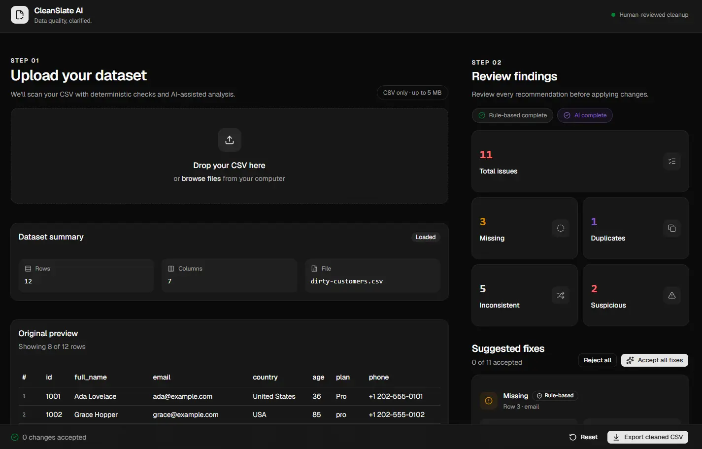

# CleanSlate AI

AI-assisted CSV data quality review with deterministic validation, structured AI suggestions, human review, and cleaned CSV export.

## Overview

CleanSlate AI helps users review and clean CSV datasets without allowing AI to modify source data automatically.

The application:

1. uploads and validates a CSV
2. previews the dataset
3. runs deterministic checks
4. runs AI-assisted semantic analysis
5. combines findings into one review workflow
6. lets the user accept, reject, or acknowledge suggestions
7. derives a cleaned dataset
8. exports the result as CSV

The original dataset remains unchanged.

## Preview



## Features

- CSV upload with drag-and-drop
- dataset summary and preview
- missing-value detection
- exact duplicate detection
- AI-assisted inconsistency detection
- AI-assisted suspicious-value detection
- structured OpenAI output validated with Zod
- human-in-the-loop review
- Accept / Reject / Acknowledge actions
- bulk cleanup actions
- cleaned CSV export
- graceful fallback when AI is unavailable
- responsive UI

## Architecture

```text
CSV Upload
    ↓
Parse + Validate
    ↓
Deterministic Analysis
- Missing values
- Exact duplicates
    ↓
AI Analysis
- Semantic inconsistencies
- Suspicious values
    ↓
Structured Output + Zod Validation
    ↓
Dataset Context Validation
    ↓
Combined DataIssue[]
    ↓
Human Review
    ↓
Apply Accepted Changes
    ↓
Cleaned CSV Export
```

I intentionally separated deterministic validation from AI reasoning.

Issues that software can detect reliably are handled locally, while AI is used for ambiguous cases where semantic context adds value.

## Tech Stack

- Next.js
- React
- TypeScript
- Tailwind CSS
- shadcn/ui
- Papa Parse
- Zod
- OpenAI API
- Lucide React
- Vercel

## Getting Started

### Requirements

- Node.js 22+
- npm
- OpenAI API key

### Install

```bash
git clone YOUR_REPOSITORY_URL
cd cleanslate-ai
npm install
```

Create `.env.local`:

```env
OPENAI_API_KEY=your_openai_api_key
OPENAI_MODEL=gpt-5.6-luna
```

Run:

```bash
npm run dev
```

Open:

```text
http://localhost:3001
```

## AI Strategy

AI is treated as an external, untrusted service.

The application:

- keeps the API key server-side
- requests structured output
- validates the response with Zod
- verifies referenced rows and columns exist
- verifies the reported current value matches the source dataset
- rejects invalid or no-op suggestions
- never allows AI to modify the original dataset directly

AI analysis is currently limited to:

- 200 rows
- 30 columns

Larger datasets can still use deterministic analysis and CSV export.

## Key Design Decisions

### Human in the loop

AI proposes changes. The user decides whether to apply them.

### Immutable source data

The original CSV is never mutated.

The cleaned dataset is derived from:

```text
original dataset + accepted issues
```

### AI is optional

If OpenAI is unavailable, deterministic analysis still works and the user can continue reviewing and exporting data.

### Scope discipline

This was built as a one-day technical challenge, so I deliberately avoided unnecessary infrastructure such as authentication, databases, microservices, and persistence.

## Limitations

- UTF-8 CSV input is expected
- no persistent sessions
- no authentication
- no manual cell editor for unresolved values
- AI output can vary between requests
- large-dataset chunking is not implemented

## Future Improvements

- manual correction for unresolved values
- additional deterministic validation rules
- large-dataset chunking or sampling
- persisted review sessions
- undo/redo history
- downloadable quality reports
- automated tests
- AI endpoint rate limiting

## Sample Data

Sample CSV files are included under:

```text
samples/
```

The main demo dataset is:

```text
samples/dirty-customers.csv
```

It includes missing values, duplicates, inconsistent formatting, malformed data, suspicious values, and Unicode characters.

## AI-Assisted Development

AI tools were used during implementation for brainstorming, UI exploration, debugging, code review, and accelerating repetitive work.

I retained responsibility for architecture, implementation decisions, validation, testing, and final behavior.

This was my first hands-on LLM API integration. I deliberately kept the AI boundary small and validated its output rather than allowing the model to control the application workflow.

## Scripts

```bash
npm run dev
npm run build
npm run lint
npm run format
npm run format:check
```

## Links

**Live App:** https://cleanslate-ai.vercel.app/
**GitHub:** https://github.com/asamuel/cleanslate-ai
